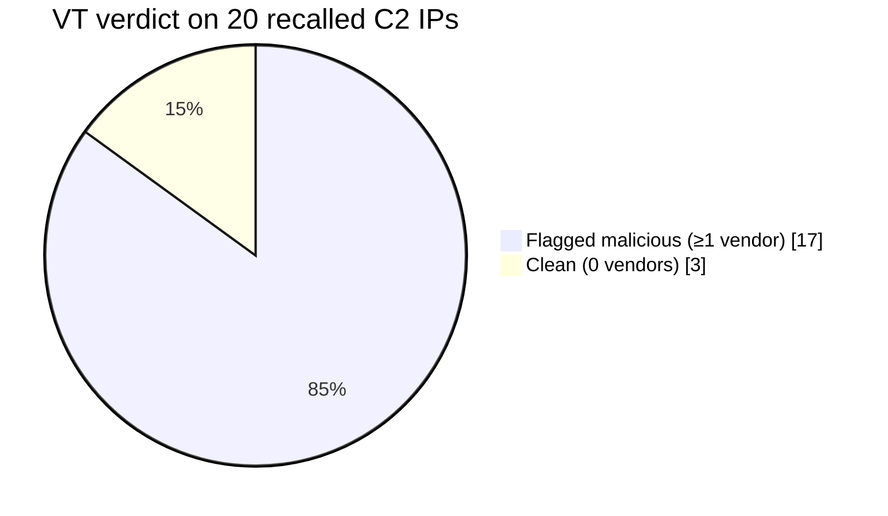

# PR: numeric-immediate C2 extraction (`cnc_scanner.py`)

## The gap

The existing three scripts find a C2 two ways: XOR-decoded out of the `table.c` blob (`xor_table.py`), or as plaintext inside `resolve_cnc_addr()` (`parse_main.py`). Some Mirai forks do neither — the C2 is written straight into a `sockaddr_in` as raw 32/16-bit integer literals, e.g.:

```c
_DAT_00512640 = 2;             // sin_family = AF_INET
_DAT_00512642 = 0x1700;        // sin_port   = 23
_DAT_00512644 = 0x5f3447a7;    // sin_addr   = 167.71.52.95
```

No string, no table entry — both existing paths are blind to it.

## What `cnc_scanner.py` does

New 4th postScript, independent of the other three, writing its own `cnc_scanner.json`. Same design rule as the rest of the tool: match on **P-Code and decompiled C, never on assembly**, so one script covers every supported architecture.

1. Recover `main()` (heuristic shape match, or via `__libc_start_main`'s argument), then walk it and its callees.
2. Scan each function's P-Code for the `sockaddr_in` write shape: a store of `AF_INET` (2) at offset 0, then constant stores at offset+2 (port) and offset+4 (address) of the same struct.
3. Reject anything that isn't a global-unicast IPv4 (filters loopback, private, multicast, and pointer-shaped values that only look like an address).
4. Classify the candidate — `cnc`, `resolver` (port 53), or `bind` (single-instance marker port) — and rank by whether it's in `main()`, whether the struct feeds a `connect()` call nearby, and whether a port is present.

### Worked example

Sample `474d28ac2e0ed518d960c9aa6ae4e40e` (ARM, stripped) has no C2 string or table entry. `cnc_scanner.py` flags `167.71.52.95:23`. Verifying by hand:

```
0x103d8: e59f39ec   LDR R3, [PC, #0x9ec]   ; load literal from 0x10dcc
0x103e0: e5823004   STR R3, [R2, #4]       ; store into sockaddr_in.sin_addr
```

The literal pool at `0x10dcc`:

```
bytes: a7 47 34 5f
     = 167 71 52 95   ->  167.71.52.95
```

Four bytes in a dedicated literal pool, loaded by a real `LDR`, stored straight into `sin_addr`, feeding a `connect()` call — the intended pattern, not a coincidental fit.

## Benchmark: 200-sample real-world corpus

| metric | original mirai-toushi (3 scripts) | with `cnc_scanner.py` | delta |
|---|--:|--:|--:|
| table extraction | 40.0% | 40.0% | — |
| **C2 extraction** | 22.0% | **40.5%** | **+18.5pp** |
| domain extraction | 2.5% | 5.0% | +2.5pp |
| timeout rate | 8.5% | 16.0% | +7.5pp |

C2 recall nearly doubles; table/domain extraction from the other three scripts is unaffected, since `cnc_scanner.py` runs last and writes an independent file. Timeout rate rises — the extra script adds analysis time per sample — the tradeoff to weigh against the recall gain.

## Is it redundant with the existing scripts?

Mostly not. Of the 63 samples where `cnc_scanner.py` found a C2:

| overlap | samples | % of hits |
|---|--:|--:|
| `xor_table.py` also found an IP independently | 4 | 6% |
| `parse_main.py`'s own numeric-literal fallback also caught it | 28 (incl. the 4 above) | 44% |
| **`cnc_scanner.py` is the only source — new discovery** | **35** | **56%** |

(`parse_main.py` already has a narrow fallback for this case — one regex against decompiled C text, `var = 0xHEX;` or `htonl(0xHEX)`, firing only inside the single function its heuristic labels `resolve_cnc_addr`. `cnc_scanner.py` generalizes it: scans `main()` and every callee, matches on P-Code shape instead of decompiler text formatting, and adds `isGlobalUnicast`/`has_connect` validation the fallback lacks.)

35/200 = 17.5pp of the corpus, matching the +18.5pp overall C2-recall gain — the benchmark improvement is real new discovery, not overlap with existing paths.

## Are the new C2s real?

20 unique IPs recalled by `cnc_scanner.py` across the corpus, checked against VirusTotal `/ip_addresses`.



| severity | vendors flagging | count |
|---|--:|--:|
| critical | ≥10 | 10 |
| flagged | 1–9 | 7 |
| clean | 0 | 3 |

85% flagged by at least one vendor, average 8.1 malicious-vendor hits per IP. Two hosting clusters reused across unrelated sample builds corroborate a shared campaign rather than coincidence:

| cluster | IPs | notes |
|---|---|---|
| Storm Industries LLC (DE) | `176.65.139.62`, `.81`, `.96` | same /24, 3 separate builds |
| TechTies Inc. (NL/DE) | `45.153.34.199`, `94.26.106.197` | same registrant, 2 separate builds |

## False positives — is it prone to them?

Cross-checked every recalled IP against VirusTotal (by hash and by IP reputation), plus manual byte-level reverse engineering for the largest clusters.

| Verdict | IPs | Samples | Meaning |
|---|--:|--:|---|
| ✅ Confirmed real C2 | 19 | 57 | Genuine hardcoded literal, VT-flagged malicious |
| ⚠️ Genuine literal, unconfirmed | 1 (`102.200.5.10`) | 6 | Real hardcoded write, but VT has zero data on this IP — can't confirm malicious |
| ❌ False positive | 0 | 0 | — |
| 🐛 Scorer bug (not the scanner) | 1 string | 1 | Benchmark script matched an IP-shaped substring inside a User-Agent string |

**No false positives found.** `cnc_scanner.py` never fit garbage into an address-shaped number — every candidate checked was a real literal at the right struct offset. One IP (`102.200.5.10`) is genuine but unverifiable as malicious via VT alone, worth flagging in review rather than trusting blindly. The one non-IP entry came from a bug in the benchmark's scoring regex, not the scanner itself.
